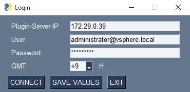
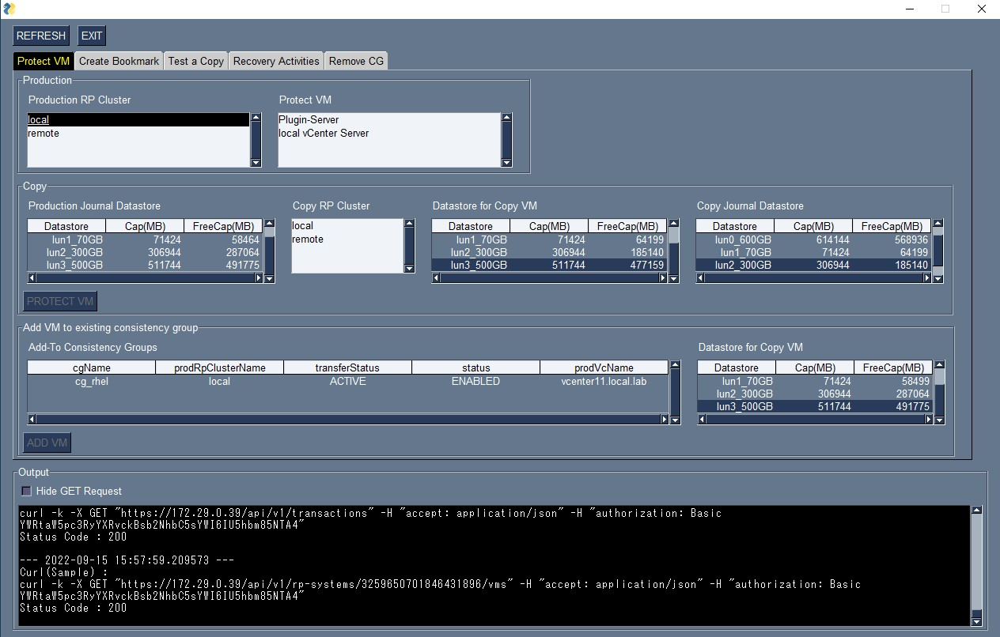
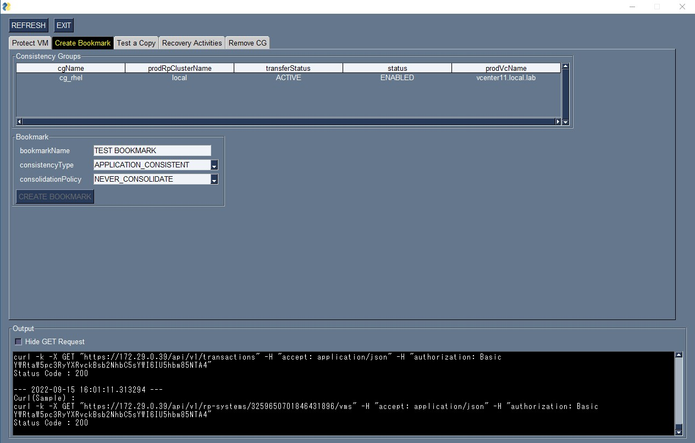
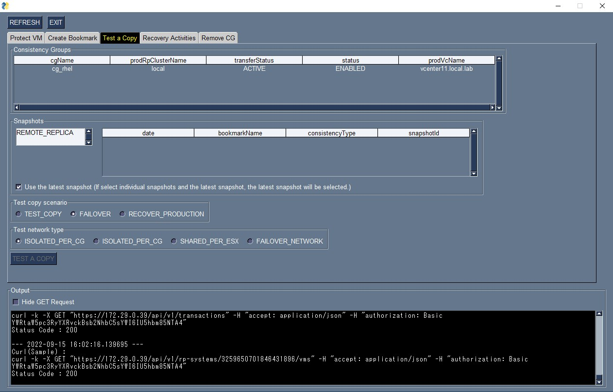
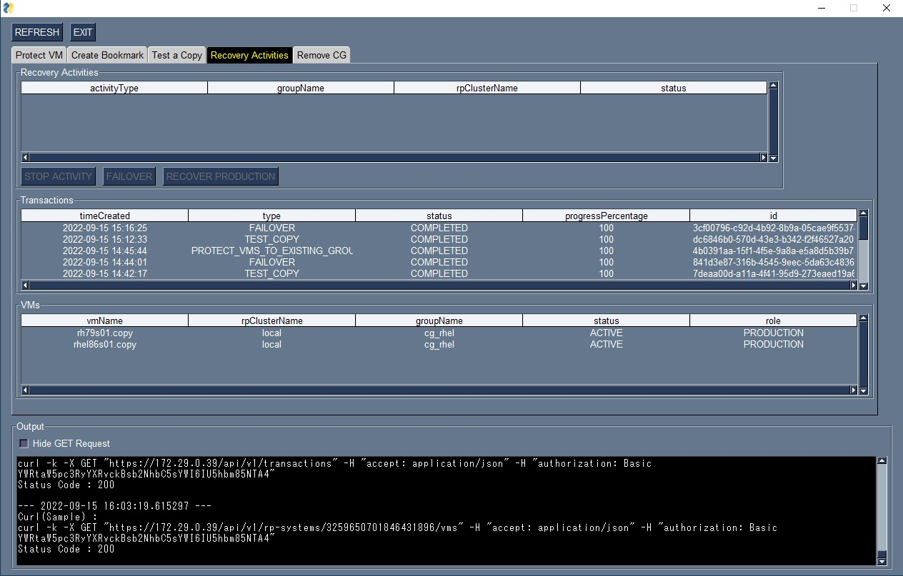
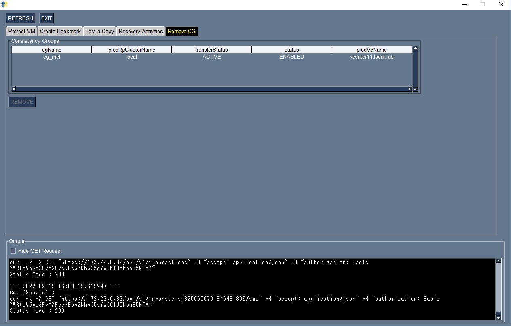

# rp4vm_RestCmdRefTool

This tool replaces and displays RecoverPoint for VMs operations in Curl commands (REST API).  
I created this tool as a confirmation tool for job control of RecoverPoint for VMs from job management software.  
The supported operations are as follows
 - ProtectVM
 - Add MV to existing Consistency Group
 - Create Bookmark
 - Test a Copy
 - Failover / Recover Production
 - Rmove CG

*Group sets and multi-site copying are not supported.

---
### download
You can download the EXE file for Windows 10 (64bit) using pyinstaller from here.  
After unzipping, run rp4vm_RestCmdRefTool_v0.XX.exe.  
[rp4vm_RestCmdRefTool_v0.90.zip](https://github.com/ss95089/rp4vm_RestCmdRefTool/blob/main/dist/rp4vm_RestCmdRefTool_v0.90.zip)
---
### development environment
RecoverPoint for Virtual Machines 5.3 SP2 P4  
Python 3.8.9  

---
### screenshot ###
    
    
    
    
    
    
